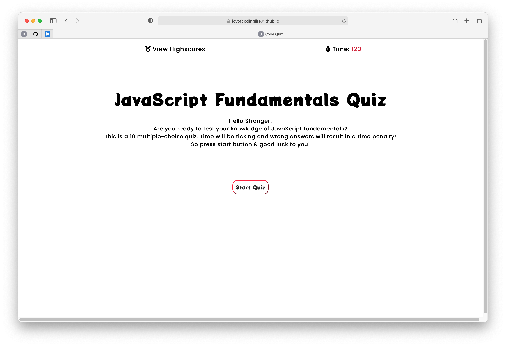

# Week4-A-Code-Quiz
* Coding Bootcamp - Assignment - Week 4 - Code Quiz

 

## Table of Contents
* [General Info](#general-info)
* [Live URL](#live-url)
* [Walkthrough](#walkthrough)
* [Webpage Preview](#webpage-preview)
* [Contributing](#contributing)
* [Notes](#notes)

 

## General Info

 

### Live URL
https://joyofcodinglife.github.io/Week4-A-Code-Quiz/

 

## Walkthrough

 

## Webpage Preview
The following images show the web application's appearance.

 

## Contributing
Pull requests are welcome. For major changes, please open an issue first to discuss what you would like to change, so I learn and understand it better.

Please make sure to update tests as appropriate.
 

## Notes
Quote that recently inspired me:

    "No one is perfect - that’s why pencils have erasers." Wolfgang Riebe

---
© 2021 L Korolyova