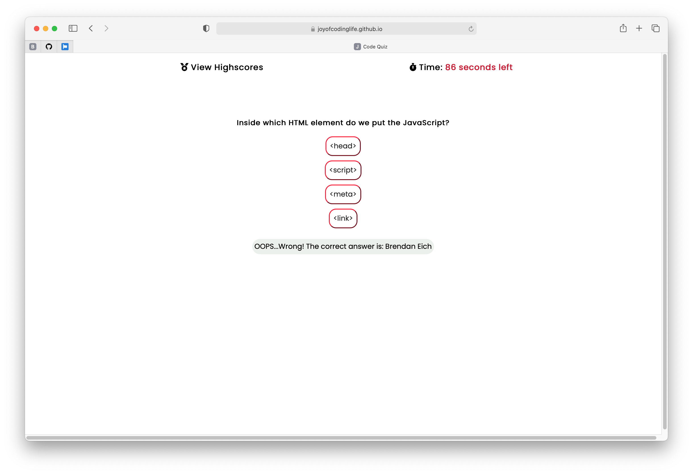
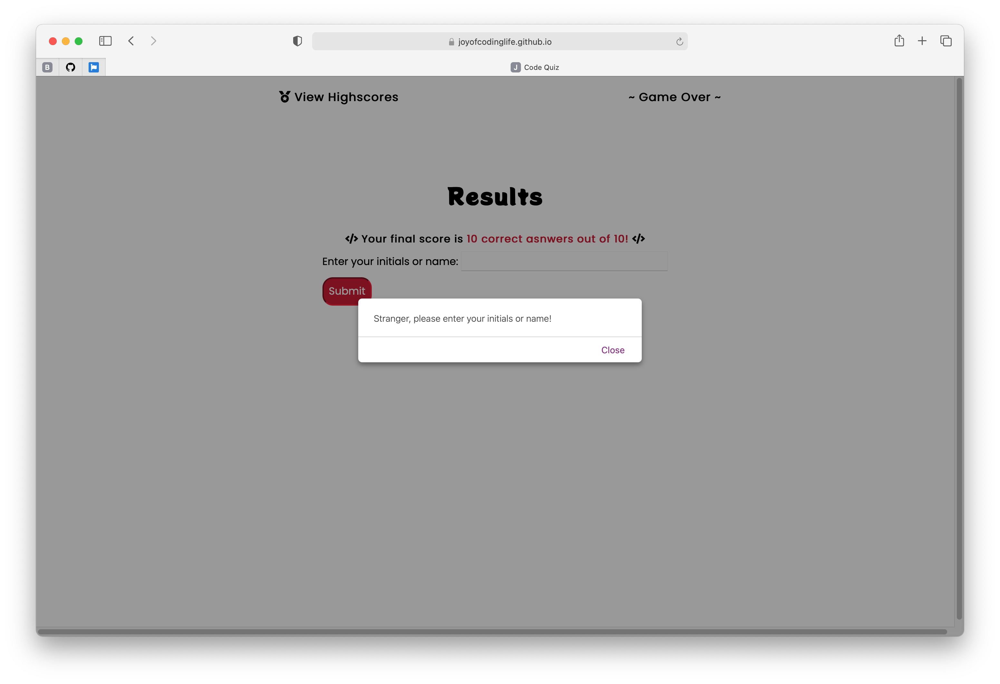
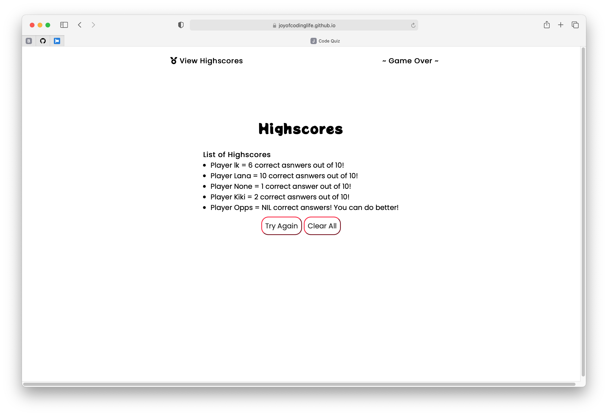

# Week4-A-Code-Quiz
* Coding Bootcamp - Assignment - Week 4 - Code Quiz

 

## Table of Contents
* [General Info](#general-info)
* [Live URL](#live-url)
* [Walkthrough](#walkthrough)
* [Webpage Preview](#webpage-preview)
* [Contributing](#contributing)
* [Notes](#notes)

 

## General Info
The task of this assignment was to build a timed coding quiz with multiple-choice questions. This app has to run in the browser and to feature dynamically updated HTML and CSS powered by JavaScript code, and all created from scratch.

I made the design very minimalistic. The same it tried to achieve in HTML, CSS and JS codes - to make them clean and easy to follow.

The most challenging part for me was make functions to save and store data.
 

### Live URL
https://korolyovalara.github.io/Code-Quiz/

 

## Walkthrough
This a timed short multiple-choice quiz, created from scratch.
It has 10 questions and 4 options, but only 1 correct answer for each question.
- When you press the START button, you will be presented with Questions screen:
    - The timer will start and the first question will appear;
    - If you answered correctly, then you will get +1 point;
    - If you answered incorrectly, then -10 seconds will be deducted from the timer;
    - Then next question will appear;
    - Once answered all question or time has runout, then game will be over;
    - Timer will stop and you will be presemted with Results screen.
- Results screen has a form to enter you initials or name, which will be saved on local storage;
    - Submit button will save it and transfer you to Highscores screen.
- Highscores Screen has a list of all players that tried the quiz (unless it has been cleared);
    - Try Again button will take you to Start screen;
    - Clear All button will clear all saved results;
- You can view Highscores at any time by pressing View Highscores at the top of the screen.

Enjoy!

 

## Webpage Preview
The following images show the web application's appearance.

 

## Contributing
Pull requests are welcome. For major changes, please open an issue first to discuss what you would like to change, so I learn and understand it better.

Please make sure to update tests as appropriate.
 

## Notes
Quote that recently inspired me:

    "No one is perfect - that’s why pencils have erasers." Wolfgang Riebe

---
© 2021 L Korolyova
